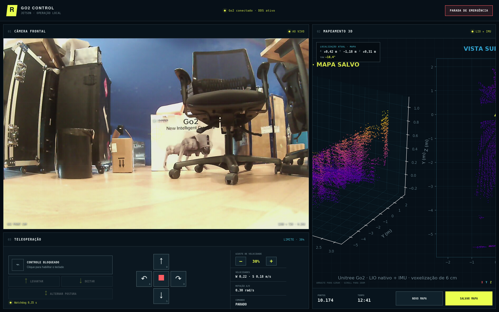
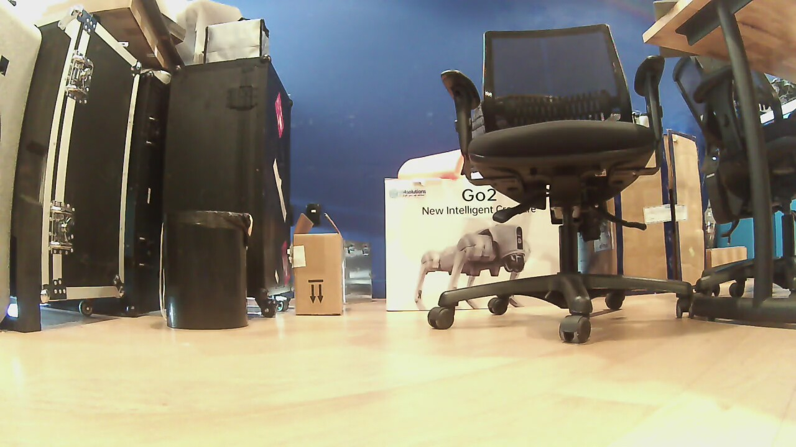
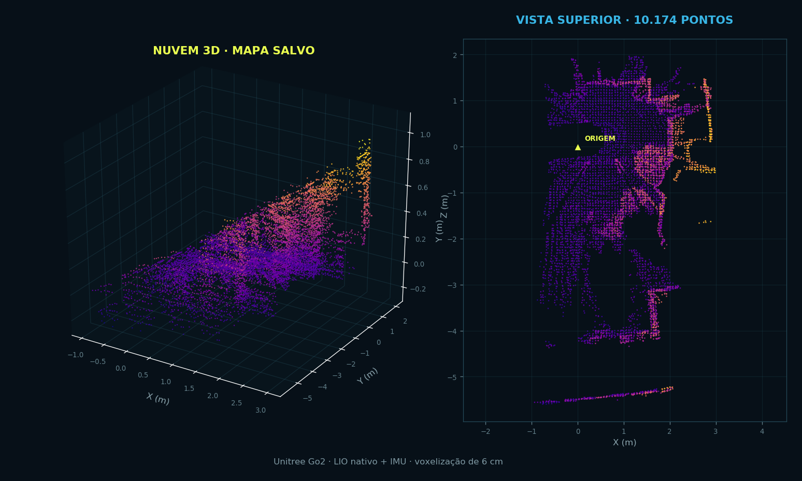
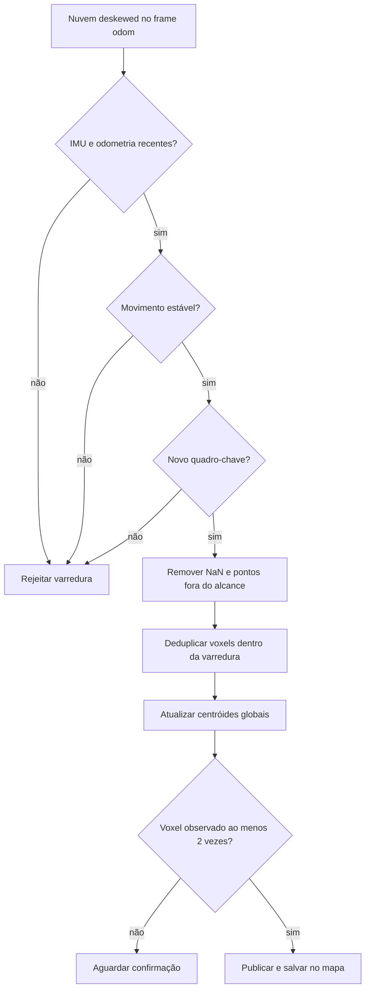

<p align="center">
  
</p>

<h1 align="center">GO2 SLAM · Mapping & Web Teleoperation</h1>

<p align="center">
  Mapeamento 3D LiDAR-inercial, localização em tempo real, câmera frontal e teleoperação segura do Unitree Go2 EDU em uma única interface web.
</p>

<p align="center">
  
  
  
  
  
</p>

<p align="center">
  <a href="#-visão-geral">Visão geral</a> ·
  <a href="#-arquitetura">Arquitetura</a> ·
  <a href="#-como-o-slam-funciona">SLAM</a> ·
  <a href="#-início-rápido">Executar</a> ·
  <a href="#-teleoperação">Controles</a> ·
  <a href="#-api-local">API</a> ·
  <a href="#-segurança">Segurança</a>
</p>

---

## ✨ Visão geral

Este projeto conecta uma **Jetson ARM64** diretamente ao DDS nativo do **Unitree Go2 EDU** e reúne três fluxos em uma página local:

1. **Câmera frontal** do robô recebida por RTP/H.264 multicast;
2. **Mapa 3D em tempo real** construído com LiDAR, LIO, odometria e IMU originais;
3. **Teleoperação protegida** por bloqueio, watchdog, parada de emergência e limite ajustável de velocidade.

O mapa é visualizado no navegador enquanto o robô se desloca e pode ser salvo como **PCD binário**, acompanhado de metadados **JSON**. A posição atual `X/Y/Z` e o `yaw` são mostrados relativamente à origem escolhida para o mapeamento.

> [!IMPORTANT]
> O mapeamento, a localização relativa, a câmera e a teleoperação estão funcionais. A navegação autônoma com planejamento de rotas/Nav2 e a operação remota pela internet 4G ainda pertencem ao roadmap.

### Estado atual

| Recurso | Estado | Implementação |
|---|:---:|---|
| LiDAR original do Go2 | ✅ | `/utlidar/cloud_deskewed` |
| Fusão LiDAR + IMU + odometria | ✅ | LIO nativo do Go2 |
| Mapa 3D no navegador | ✅ | Canvas interativo com rotação e zoom |
| Salvamento de mapa | ✅ | `.pcd` binário + `.json` |
| Localização atual | ✅ | `X`, `Y`, `Z` e `yaw` relativos à origem |
| Câmera frontal | ✅ | RTP/H.264 → GStreamer/OpenCV → MJPEG |
| Teleoperação `WASD` | ✅ | Avançar, recuar e girar no próprio eixo |
| Controle de postura | ✅ | Levantar e deitar |
| Velocidade ajustável | ✅ | 10% a 50%, passos de 5% |
| Watchdog e emergência | ✅ | Parada em 0,35 s e desarme imediato |
| Operação pela rede 4G | 🛠️ | Planejada; requer autenticação e TLS |
| Navegação autônoma | 🛠️ | Planejada; requer costmap, localização e planner |
| Oracle Vision/IA | 🛠️ | Integração futura |

## 🖥️ Painel operacional

<p align="center">
  
</p>

O front-end é propositalmente enxuto: não exige Node.js nem etapa de build. Ele é formado por HTML, CSS e JavaScript estáticos, servidos pelo backend Python que também conversa com ROS 2, decodifica a câmera e expõe a API local.

<table>
  <tr>
    <td width="50%" align="center">
      
      <br /><sub><b>Câmera real do Go2</b> · 1280×720 a 30 FPS</sub>
    </td>
    <td width="50%" align="center">
      
      <br /><sub><b>Mapa real salvo</b> · 10.174 pontos consolidados</sub>
    </td>
  </tr>
</table>

## 🧭 Arquitetura

```mermaid
flowchart LR
    subgraph GO2[Unitree Go2 EDU]
        LIDAR[LiDAR original]
        IMU[IMU + odometria]
        CAM[Câmera frontal]
        MOTION[Locomoção e postura]
    end

    subgraph DDS[ROS 2 / CycloneDDS]
        CLOUD[/utlidar/cloud_deskewed]
        ODOM[/utlidar/robot_odom]
        IMUT[/utlidar/imu]
        REMOTE[/api/obstacles_avoid/request]
        SPORT[/api/sport/request]
    end

    subgraph JETSON[NVIDIA Jetson]
        SLAM[Go2MappingNode]
        VOXEL[Quadros-chave + voxels únicos]
        SERVER[Servidor Python]
        GST[GStreamer + OpenCV]
        STORE[(PCD + JSON)]
    end

    subgraph WEB[Navegador local]
        VIDEO[Vídeo MJPEG]
        MAP[Mapa 3D + localização]
        TELEOP[WASD + postura + velocidade]
    end

    LIDAR --> CLOUD --> SLAM
    IMU --> ODOM --> SLAM
    IMU --> IMUT --> SLAM
    SLAM --> VOXEL --> SERVER
    VOXEL --> STORE
    CAM -- RTP/H.264 --> GST --> SERVER
    SERVER --> VIDEO
    SERVER --> MAP
    TELEOP --> SERVER --> REMOTE --> MOTION
    SERVER --> SPORT --> MOTION
```

### Fluxos principais

| Fluxo | Origem | Transporte | Destino |
|---|---|---|---|
| Nuvem corrigida | LiDAR/LIO do Go2 | ROS 2 DDS | `Go2MappingNode` |
| Movimento do robô | Odometria nativa | ROS 2 DDS | Localização e seleção de keyframes |
| Estabilidade | IMU original | ROS 2 DDS | Rejeição de quadros instáveis |
| Vídeo | Câmera frontal | RTP/H.264 multicast | GStreamer/OpenCV |
| Mapa web | Backend | JSON com até 15 mil pontos | Canvas do navegador |
| Teleoperação | Navegador | HTTP JSON | API remota do Go2 |
| Persistência | Mapa consolidado | PCD + JSON | `go2_native_ws/maps/` |

## 🧠 Como o SLAM funciona

O projeto não realinha nuvens cruas no navegador. Ele consome a nuvem **já compensada pelo LIO nativo** no frame fixo `odom` e aplica uma segunda camada de controle de qualidade antes de acumular o mapa.



### Parâmetros de robustez

| Parâmetro | Valor padrão | Função |
|---|---:|---|
| Tamanho do voxel | `0,06 m` | Mantém um centróide consolidado por célula 3D |
| Observações mínimas | `2` | Remove pontos vistos apenas uma vez |
| Distância de keyframe | `0,04 m` | Evita inserir quadros quase idênticos |
| Rotação de keyframe | `2,5°` | Captura mudanças angulares relevantes |
| Intervalo máximo | `0,8 s` | Garante atualização mesmo com pouco movimento |
| Alcance máximo | `20 m` | Descarta medições excessivamente distantes |
| Velocidade angular IMU | `1,5 rad/s` | Rejeita varreduras durante giros bruscos |
| Variação de aceleração | `4,0 m/s²` | Rejeita instabilidade forte |
| Salto máximo de odometria | `0,20 m` | Evita incorporar uma pose claramente descontínua |
| Máximo de pontos internos | `500.000` | Limita o uso de memória |
| Pontos enviados ao navegador | `15.000` | Mantém a visualização responsiva |

A deduplicação por voxel reduz superfícies duplicadas e o efeito de sobreposição. Como qualquer sistema SLAM real, a qualidade final ainda depende de boa odometria, calibração, textura geométrica no ambiente e condução lenta.

## 🚀 Início rápido

### Hardware validado

- Unitree Go2 EDU com LiDAR, IMU e câmera originais;
- NVIDIA Jetson ARM64 com Ubuntu 20.04;
- conexão Ethernet direta ao robô pela interface `eth0`;
- Jetson na rede `192.168.123.0/24`;
- robô acessível como `unitree.local` ou `192.168.123.161`.

### Software

- ROS 2 Foxy;
- CycloneDDS `0.10.x`;
- pacotes ROS 2 `unitree_go` e `unitree_api`;
- Python 3, NumPy, OpenCV e `rclpy`;
- GStreamer com decodificação H.264;
- RViz 2, opcional para a visualização nativa.

### 1. Clonar

```bash
git clone https://github.com/ThayAlms/SLAM-Navigation---GO2-EDU-Mapping-Rviz-and-WebViewr-Map-.git
cd SLAM-Navigation---GO2-EDU-Mapping-Rviz-and-WebViewr-Map-
```

### 2. Compilar o ambiente Unitree em uma instalação nova

As pastas `build/`, `install/` e `log/` não são versionadas. Em uma máquina nova, compile o CycloneDDS e as mensagens Unitree:

```bash
cd go2_native_ws/unitree_ros2/cyclonedds_ws

# Primeiro o CycloneDDS 0.10.x, sem ter carregado outro ambiente ROS no terminal.
colcon build --packages-select cyclonedds

# Depois as mensagens e a integração ROS 2.
source /opt/ros/foxy/setup.bash
colcon build

cd ../../..
```

Consulte também a documentação original em [`go2_native_ws/unitree_ros2/README.md`](go2_native_ws/unitree_ros2/README.md) para dependências de sistema e outras distribuições ROS.

### 3. Conferir a interface de rede

O arquivo [`go2_native_ws/setup_go2.sh`](go2_native_ws/setup_go2.sh) está configurado para `eth0`. Se a interface ligada ao Go2 tiver outro nome, altere `NetworkInterface name="eth0"` antes de executar.

```bash
ip -br address
ping -c 1 unitree.local
```

### 4. Executar o painel

```bash
./project_portal/run_dashboard.sh
```

Abra no navegador:

```text
http://127.0.0.1:8080
```

O servidor inicia deliberadamente apenas em `127.0.0.1`. O controle começa **bloqueado** e o robô não deve se mover até o operador habilitá-lo na página.

## 🗺️ Procedimento de mapeamento

1. Coloque o Go2 próximo a uma parede ou canto conhecido;
2. deixe o ambiente livre e mantenha uma pessoa perto do robô;
3. levante o robô e aguarde a estabilização da IMU/LIO;
4. confirme no painel que câmera, LiDAR e DDS estão conectados;
5. pressione **NOVO MAPA** para definir a origem atual;
6. habilite o controle;
7. percorra o ambiente lentamente, evitando giros e arrancadas bruscas;
8. observe a nuvem e a posição do robô em tempo real;
9. volte próximo ao ponto inicial sempre que possível;
10. pressione **SALVAR MAPA**.

Os arquivos são gravados em:

```text
go2_native_ws/maps/
├── mapa_go2_YYYYMMDD_HHMMSS.pcd
└── mapa_go2_YYYYMMDD_HHMMSS.json
```

O JSON registra origem, limites do mapa, quantidade de pontos, duração, tópicos utilizados, tamanho do voxel e parâmetros de deduplicação.

### Modo RViz + teclado

Também é possível executar o nó diretamente com RViz:

```bash
./go2_native_ws/go2_slam/run_mapping.sh
```

No terminal desse modo:

| Tecla | Ação |
|:---:|---|
| `I` | Armar o movimento |
| `O` | Desarmar o movimento |
| `W` / `↑` | Avançar |
| `S` / `↓` | Recuar |
| `A` / `←` | Girar à esquerda |
| `D` / `→` | Girar à direita |
| `Espaço` | Parar imediatamente |
| `P` | Salvar o mapa |
| `C` | Limpar e iniciar outro mapa |
| `Esc` | Salvar automaticamente e sair |

## 🎮 Teleoperação

### Controles web

| Controle | Movimento |
|:---:|---|
| `W` ou `↑` | Avançar |
| `S` ou `↓` | Recuar lentamente |
| `A` ou `←` | Girar no próprio eixo para a esquerda |
| `D` ou `→` | Girar no próprio eixo para a direita |
| `Espaço` | Parar |
| `−` / `+` | Diminuir ou aumentar a velocidade |
| **LEVANTAR** | Executar `StandUp` |
| **DEITAR** | Executar `StandDown` |
| **PARADA DE EMERGÊNCIA** | Parar, desarmar e devolver o controle ao modo seguro |

### Perfis de velocidade

O nível padrão é **30%**. O ajuste varia entre **10% e 50%**, em passos de 5%. Antes de aplicar outro nível, o backend envia uma parada.

| Nível | Frente | Ré | Giro |
|---:|---:|---:|---:|
| 10% | `0,073 m/s` | `0,060 m/s` | `0,10 rad/s` |
| 30% | `0,220 m/s` | `0,180 m/s` | `0,30 rad/s` |
| 50% | `0,367 m/s` | `0,300 m/s` | `0,50 rad/s` |

Os comandos precisam ser renovados continuamente. Se deixarem de chegar por **0,35 segundo**, o watchdog publica velocidade zero e um comando de parada.

## 📡 Sensores e tópicos

### LiDAR, LIO e IMU originais

| Tópico | Tipo | Uso |
|---|---|---|
| `/utlidar/cloud` | `sensor_msgs/PointCloud2` | Nuvem crua para diagnóstico/gravação |
| `/utlidar/cloud_deskewed` | `sensor_msgs/PointCloud2` | Nuvem compensada usada no mapa |
| `/utlidar/imu` | `sensor_msgs/Imu` | Estabilidade e movimento inercial |
| `/utlidar/robot_odom` | `nav_msgs/Odometry` | Pose no frame do mapa |
| `/utlidar/robot_pose` | Pose nativa | Diagnóstico e rosbag |
| `/sportmodestate` | `unitree_go/SportModeState` | Postura, velocidade e forças de apoio |
| `/go2_slam/map_cloud` | `sensor_msgs/PointCloud2` | Mapa consolidado publicado pelo projeto |
| `/go2_slam/status` | `std_msgs/String` | Estado do mapeamento em JSON |

### Câmera frontal

| Propriedade | Valor validado |
|---|---|
| Protocolo | RTP/H.264 multicast |
| Grupo | `230.1.1.1` |
| Porta UDP | `1720` |
| Interface | `eth0` |
| Resolução | `1280 × 720` |
| Taxa | `30 FPS` |
| Saída web | `/camera.mjpg` |

## 🔌 API local

O backend não depende de framework web externo. Ele usa `ThreadingHTTPServer` e expõe somente as rotas necessárias ao painel.

| Método | Rota | Função |
|:---:|---|---|
| `GET` | `/api/status` | Sensores, pose, postura, velocidade e estado do mapa |
| `GET` | `/api/map/points` | Amostra XYZ para a visualização web |
| `GET` | `/camera.mjpg` | Stream MJPEG da câmera frontal |
| `POST` | `/api/control/arm` | Habilita ou bloqueia a teleoperação |
| `POST` | `/api/control/move` | `forward`, `backward`, `rotate_left`, `rotate_right` ou `stop` |
| `POST` | `/api/control/posture` | `stand_up`, `stand_down` ou `toggle` |
| `POST` | `/api/control/speed` | Ajusta o limite entre 10% e 50% |
| `POST` | `/api/control/stop` | Para e desarma o controle |
| `POST` | `/api/map/reset` | Limpa o mapa e redefine a origem |
| `POST` | `/api/map/save` | Salva PCD e JSON |

Exemplo de consulta local:

```bash
curl http://127.0.0.1:8080/api/status | python3 -m json.tool
```

## 🧪 Diagnóstico e gravação

### Verificar rede, Go2, câmera e MID-360

```bash
./diagnostics/check_sensors.sh
```

### Visualizar LiDAR e câmera originais

```bash
./go2_native_ws/view_go2_sensors.sh
```

### Testar apenas o LiDAR

```bash
./go2_native_ws/check_go2_lidar.sh 12
```

### Gravar rosbag para desenvolvimento offline

```bash
./go2_native_ws/record_mapping_data.sh
```

São gravados LiDAR, IMU, odometria, pose e estado de baixo nível. Isso permite testar alterações do SLAM sem repetir fisicamente todo o percurso.

## 🛰️ Workspace opcional Livox MID-360

O diretório [`slam_ws/`](slam_ws/) preserva uma segunda arquitetura com **Livox MID-360 + FAST-LIO2**. Ela é independente do fluxo principal baseado nos sensores originais do Go2.

```bash
cd slam_ws
./build.sh
./run_mapping.sh
```

Configuração atualmente documentada:

- adaptador dedicado: `eth1`;
- IP da Jetson para o driver: `192.168.123.171`;
- MID-360 esperado: `192.168.123.120`;
- alimentação externa obrigatória: **9–27 V DC**;
- saída FAST-LIO: `maps/pcd/scans.pcd`.

> [!WARNING]
> O MID-360 não deve receber PoE pelo RJ45. A alimentação DC separada continua obrigatória. Se `eth1` estiver em `NO-CARRIER`, nenhum ajuste de IP resolverá até que alimentação, cabo e adaptadores tenham link físico.

## 📁 Estrutura do repositório

```text
.
├── project_portal/                 # Interface web e backend local
│   ├── index.html                  # Câmera, mapa e controles
│   ├── styles.css                  # Identidade visual responsiva
│   ├── app.js                      # UI, teclado, mapa 3D e API
│   ├── server.py                   # ROS 2, câmera e servidor HTTP
│   └── run_dashboard.sh            # Inicialização segura do painel
│
├── go2_native_ws/                  # Fluxo principal: sensores do Go2
│   ├── go2_slam/mapping_node.py    # Mapa, localização, teleop e segurança
│   ├── config/                     # Perfis RViz
│   ├── maps/                       # Mapas PCD e metadados JSON
│   ├── unitree_ros2/               # Mensagens e integração ROS 2/DDS
│   ├── unitree_sdk2/               # SDK oficial Unitree
│   └── setup_go2.sh                # Ambiente ROS/CycloneDDS em eth0
│
├── diagnostics/                    # Rede, câmera e testes dos sensores
├── slam_ws/                        # Exemplo opcional MID-360 + FAST-LIO2
├── Livox-SDK2/                     # SDK oficial Livox
└── docs/assets/                    # Imagens da documentação
```

## 🛡️ Segurança

> [!CAUTION]
> Um robô quadrúpede pode causar colisões, quedas ou prensamento. Nunca teste movimento sem espaço livre e uma pessoa pronta para intervir.

- O painel inicia com o movimento **bloqueado**;
- movimento só é aceito quando o robô é identificado como `standing`;
- o watchdog interrompe comandos ausentes em `0,35 s`;
- a troca de velocidade sempre começa com uma parada;
- a parada de emergência desarma o controle;
- o encerramento do servidor envia múltiplos comandos de parada;
- mapas com dados suficientes recebem autosave no encerramento;
- mantenha o controle físico disponível durante os primeiros testes;
- não dependa exclusivamente de anticolisão ou sensores para proteger pessoas;
- para mapear, use velocidade baixa, curvas suaves e uma origem conhecida.

## 🔭 Roadmap

- [x] Descoberta e validação dos sensores originais do Go2;
- [x] câmera frontal na Jetson;
- [x] mapa 3D LiDAR-inercial em tempo real;
- [x] deduplicação espacial e rejeição de quadros instáveis;
- [x] localização atual no mapa;
- [x] salvamento PCD + JSON;
- [x] teleoperação web com postura, velocidade e emergência;
- [ ] autenticação de usuários e logs com Supabase;
- [ ] publicação segura do painel pela rede 4G;
- [ ] TLS, autorização por função e auditoria de comandos;
- [ ] captura de frame e integração com IA Oracle;
- [ ] costmap 2D/3D e planejamento de trajetórias;
- [ ] localização persistente em mapas salvos;
- [ ] navegação autônoma com retorno seguro à origem;
- [ ] caixa 3D para modem/roteador 4G e antenas.

## 🧯 Solução de problemas

| Sintoma | Verificação |
|---|---|
| Painel mostra “Backend desconectado” | Confirme que `run_dashboard.sh` continua ativo e a porta 8080 está livre |
| Nenhum tópico ROS 2 aparece | Confira `eth0`, `ROS_DOMAIN_ID=0`, CycloneDDS e multicast |
| Câmera sem imagem | Verifique multicast `230.1.1.1:1720`, GStreamer e a interface `eth0` |
| Mapa vazio | Confirme os três tópicos `/utlidar/cloud_deskewed`, `/utlidar/imu` e `/utlidar/robot_odom` |
| Muitos quadros rejeitados | Reduza movimentos bruscos e aguarde a IMU estabilizar |
| Robô não aceita `A/D` | Confirme postura `standing`, controle armado e resposta da API remota |
| Robô para ao soltar a tecla | Comportamento esperado do watchdog |
| MID-360 não responde | Primeiro resolva `NO-CARRIER`; depois confira IP e rota da `eth1` |

Mais detalhes estão em [`diagnostics/REDE_E_SENSORES.md`](diagnostics/REDE_E_SENSORES.md).

## 🤝 Créditos e dependências

Este repositório integra e referencia tecnologias de:

- [Unitree Robotics](https://github.com/unitreerobotics) — Go2, SDK2 e ROS 2;
- [Eclipse CycloneDDS](https://github.com/eclipse-cyclonedds/cyclonedds) — comunicação DDS;
- [Livox](https://github.com/Livox-SDK/Livox-SDK2) — SDK2 e driver MID-360;
- [FAST-LIO2](https://github.com/hku-mars/FAST_LIO) — referência e workspace LiDAR-inercial;
- ROS 2, OpenCV, GStreamer e NumPy.

As dependências incorporadas mantêm seus próprios avisos de copyright e licenças. Consulte os arquivos `LICENSE` de cada diretório antes de redistribuir binários ou derivados.

---

<p align="center">
  Feito para transformar o Go2 em uma plataforma de mapeamento, inspeção e operação remota — uma etapa segura de cada vez.
</p>
