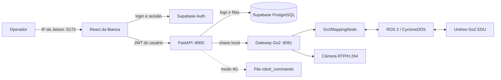

<p align="center">
  
</p>

<h1 align="center">GO2 SLAM · Operação Web Integrada</h1>

<p align="center">
  Login e auditoria com Supabase, painel React, FastAPI, câmera frontal, localização, mapa 3D e teleoperação segura do Unitree Go2 EDU.
</p>

<p align="center">
  
  
  
  
  
</p>

## Visão geral

Este repositório unifica dois projetos:

- a integração ROS/SLAM, câmera e controle do Go2;
- o frontend, backend e banco do `ProjetoOracleFrontBanco`, de Bianca Cancian.

O frontend antigo em HTML estático foi substituído pelo aplicativo React. O navegador não conversa diretamente com ROS nem recebe segredos do banco: toda ação operacional autenticada passa pelo FastAPI, que encaminha os dados para um gateway local executado na Jetson.

### O que está disponível

| Recurso | Estado | Implementação |
| --- | :---: | --- |
| Login e sessão | ✅ | Supabase Auth; sem cadastro público |
| Perfis e criação de usuários | ✅ | Administrador cria operadores ou administradores |
| Histórico de login | ✅ | FastAPI + `login_logs` com RLS |
| Painel protegido | ✅ | React Router + sessão Supabase |
| Câmera frontal | ✅ | RTP/H.264 → gateway → FastAPI → quadro protegido |
| Mapa 3D em tempo real | ✅ | LiDAR/LIO/IMU → nuvem deduplicada → Canvas React |
| Localização atual | ✅ | `X`, `Y`, `Z` e `yaw` relativos à origem |
| Salvar e reiniciar mapa | ✅ | PCD binário + JSON de metadados |
| Teleoperação `WASD` | ✅ | Avançar, recuar e girar no próprio eixo |
| Controles PS4/PS5/Xbox | ✅ | Gamepad API nativa, três eixos analógicos e botões do RC Unitree |
| Levantar e deitar | ✅ | API Sport do Go2 |
| Controle de velocidade | ✅ | 100% equivale ao máximo publicado do Go2 EDU (aprox. 5 m/s em laboratório) |
| Obstacle Avoidance | ✅ | Serviço `obstacles_avoid` do próprio Go2, ativável no painel |
| Damping | ✅ | Modo oficial de amortecimento da API Sport do Go2 |
| Fila para operação 4G | ✅ | Supabase `robot_commands` |
| Solicitação Oracle | 🟡 | Fila criada; processamento externo ainda será conectado |
| Navegação autônoma | 🟡 | Próxima etapa: planner, costmap e missões |

## Arquitetura



Há duas formas de transportar comandos:

1. `ROBOT_GATEWAY_URL` configurada: o FastAPI executa imediatamente na Jetson;
2. URL vazia: o FastAPI registra o comando no Supabase para um consumidor remoto/4G.

O frontend usa o mesmo endpoint nos dois casos. Assim, a futura troca de transporte não exige reescrever os botões.

## Estrutura do repositório

```text
.
├── frontend/                 React/Vite, login e painel operacional
│   └── src/
│       ├── components/       câmera, mapa, cabeçalho e componentes comuns
│       ├── context/          sessão Supabase
│       ├── pages/            login e dashboard
│       └── services/         cliente autenticado do FastAPI
├── backend/                  API FastAPI e testes
│   └── app/
│       ├── routers/          auth, robô, Oracle e integrações
│       └── robot_gateway.py  cliente do gateway local
├── robot_gateway/            ROS 2, câmera, mapa e comandos do Go2
├── go2_native_ws/            nó LIO/SLAM e SDK Unitree
├── supabase/
│   ├── migrations/           tabelas, triggers, RLS e comandos do Go2
│   └── admin_queries.sql     consultas administrativas somente leitura
├── diagnostics/              diagnósticos de rede e sensores
├── scripts/check_supabase.sh pré-teste obrigatório do banco remoto
├── publish_vercel.sh         valida, envia ao GitHub e dispara o deploy
├── run_vercel.sh             conecta LiDAR, câmera e controle à Vercel
└── run_web.sh                inicialização completa pelo IP da Jetson
```

## Início rápido

### 1. Preparar o Supabase

No SQL Editor do projeto Supabase, aplique em ordem:

1. `supabase/migrations/202607150001_initial_schema.sql`;
2. `supabase/migrations/202607150002_sync_auth_profiles.sql`;
3. `supabase/migrations/202607160003_go2_control_commands.sql`;
4. `supabase/migrations/202607200004_gamepad_control.sql`;
5. `supabase/migrations/202607200005_recovery_stand.sql`.

Em **Authentication → Users**, crie manualmente a primeira conta e marque o e-mail como confirmado. Depois, no SQL Editor, torne-a administradora:

```sql
update public.profiles
set role = 'admin'
where email = 'email@empresa.com';
```

Por fim, desative o cadastro público nas configurações de Authentication. As demais contas serão criadas pelo administrador dentro do painel e já ficarão confirmadas para entrada imediata.

### 2. Configurar as credenciais locais

```bash
cp frontend/.env.example frontend/.env.local
cp backend/.env.example backend/.env
```

No `frontend/.env.local`, preencha apenas informações públicas:

```dotenv
VITE_SUPABASE_URL=https://SEU-PROJETO.supabase.co
VITE_SUPABASE_PUBLISHABLE_KEY=sb_publishable_...
VITE_API_URL=http://localhost:8000
```

No `backend/.env`, use o mesmo projeto e mantenha a chave secreta somente no backend:

```dotenv
SUPABASE_URL=https://SEU-PROJETO.supabase.co
SUPABASE_PUBLISHABLE_KEY=sb_publishable_...
SUPABASE_SERVICE_ROLE_KEY=sb_secret_...
ROBOT_GATEWAY_URL=http://127.0.0.1:8081
ROBOT_GATEWAY_API_KEY=uma-chave-local-longa
```

> Nunca coloque `SUPABASE_SERVICE_ROLE_KEY` em uma variável `VITE_*` ou em um commit.

### 3. Executar tudo com um comando

Na Jetson:

```bash
./run_web.sh
```

O script:

- confere se frontend e backend usam o mesmo projeto Supabase;
- testa o Supabase Auth e a chave pública;
- testa a chave privada e confirma a migration `robot_status`;
- constrói o React e o FastAPI em imagens ARM64;
- inicia o gateway ROS/SLAM local;
- publica o frontend em `http://IP-DA-JETSON:5173`;
- exibe a URL final no terminal e encerra tudo com `Ctrl+C`.

Se a detecção automática escolher a interface errada:

```bash
WEB_HOST_IP=192.168.123.18 ./run_web.sh
```

### Executar com o painel publicado na Vercel

Com o LiveKit e a Vercel já configurados, use apenas:

```bash
./run_vercel.sh
```

O comando aproveita o projeto autenticado na CLI `lk`, localiza o Ingress da
câmera sem salvar suas credenciais no repositório, inicia o gateway ROS/SLAM e
publica câmera, LiDAR, telemetria e controle remoto. Ele também localiza o
deployment de produção mais recente e abre o painel no navegador da Jetson.

### Wi-Fi automático no boot: XD4 com fallback para Thaina

O serviço `go2-vercel.service` executa
`scripts/prepare_thaina_network.sh` antes do gateway. O script procura primeiro
o SSID `XD4` e ativa o perfil `XD4 Local`, com prioridade de autoconnect `100`.
Quando `XD4` não está disponível, ele cria (se necessário) e ativa o perfil
`Thaina`, usando a senha configurada no serviço e prioridade `50`. Assim, uma
queda posterior da rede principal também permite ao NetworkManager tentar o
fallback automaticamente. Em ambos os casos, `eth0` permanece somente na rede
local do Go2 e a rota default de internet usa `wlan0`.

Os nomes, SSIDs e a senha podem ser alterados pelas variáveis
`GO2_UPLINK_CONNECTION`, `GO2_UPLINK_SSID`, `GO2_FALLBACK_CONNECTION`,
`GO2_FALLBACK_SSID` e `GO2_FALLBACK_PASSWORD` no ambiente do serviço.

Por segurança, a senha do Wi-Fi não fica no repositório. Para configurá-la no
robô, crie `/etc/oracle-go2-teleoperation/network.env` com permissão restrita:

```bash
sudo install -d -m 700 /etc/oracle-go2-teleoperation
sudoedit /etc/oracle-go2-teleoperation/network.env
sudo chmod 600 /etc/oracle-go2-teleoperation/network.env
```

O conteúdo do arquivo deve seguir este formato:

```dotenv
GO2_FALLBACK_PASSWORD=troque_pela_senha_da_rede
```

Para repetir todas as verificações de rede:

```bash
./scripts/validate_xd4_network.sh
```

Os comandos individuais são:

```bash
nmcli device status
ip route
ping -c 3 -W 3 8.8.8.8
ping -c 3 -W 3 google.com
```

Para usar um domínio específico ou não abrir o navegador automaticamente:

```bash
VERCEL_APP_URL=https://painel.exemplo.com ./run_vercel.sh
OPEN_BROWSER=0 ./run_vercel.sh
```

### Ver e publicar alterações do frontend

Para testar localmente câmera, mapa e administração antes de publicar, pare uma
execução ativa com `Ctrl+C` e rode:

```bash
./run_web.sh
```

Quando estiver satisfeito, publique sem abrir o painel da Vercel:

```bash
./publish_vercel.sh "fix: camera, mapa e acesso administrativo"
```

O script mostra os arquivos alterados, pede confirmação, executa as validações,
cria o commit e envia a branch `main`. A integração do repositório com a Vercel
faz o deployment automaticamente após o `push`.

## Painel e controles

Depois do login, o usuário comum entra diretamente nos recursos operacionais pedidos: câmera, mapeamento/localização e teleoperação. O administrador vê também a opção **Usuários**, onde pode adicionar operadores ou outros administradores.

| Entrada | Ação |
| --- | --- |
| **Botões** | seleciona botões, teclado e joystick da tela como fonte de movimento |
| **Controle USB** | seleciona o gamepad físico como única fonte de movimento |
| `W` ou `↑` | avançar |
| `S` ou `↓` | recuar |
| `A` ou `←` | girar à esquerda no próprio eixo |
| `D` ou `→` | girar à direita no próprio eixo |
| soltar a tecla | parar imediatamente |
| espaço | parada de movimento |
| Levantar / Deitar | mudar postura |
| `−` / `+` | ajustar velocidade segura |
| Damping | acionar o modo oficial de amortecimento da Unitree |
| Ativar / Desativar Obstacle Avoidance | alternar e confirmar o estado do serviço nativo |
| Manche esquerdo USB | frente/ré e deslocamento lateral analógico |
| Manche direito USB | giro analógico |
| Direcional USB | frente/ré e giro, inclusive em controles sem manches |
| `START`/`Options` | habilitar o canal de controle |
| `L2 + B`/Círculo | damping de emergência |
| `L2 + X`/Quadrado | recuperar e levantar (RecoveryStand oficial) |
| `L2 + A`/Cruz | alternar entre levantar e deitar |
| `X`/Quadrado | ligar Obstacle Avoidance |
| `Y`/Triângulo por 3 s | desligar Obstacle Avoidance |

Para mover, o operador precisa habilitar o controle, o robô precisa estar em pé e o estado solicitado do Obstacle Avoidance precisa estar confirmado. Um heartbeat é enviado enquanto a tecla permanece pressionada; ao soltar a tecla o painel envia parada imediatamente e o watchdog do gateway aplica uma segunda parada em até `0,25 s` se os comandos cessarem.

Os botões `−/+` selecionam níveis exatos de 10% a 100%. O ganho é progressivo
para permitir manobras próximas sem perder o máximo: 20% limita o comando
frontal a `0,20 m/s`, 50% a `1,25 m/s` e 100% mantém o máximo de laboratório de
`5,00 m/s`. Antes de chegar ao serviço `obstacles_avoid`, as velocidades são
normalizadas para o curso `−1…1` esperado pelo controle remoto; isso impede que
20%, 30% e os demais níveis saturem e pareçam ter a mesma velocidade.

Na versão publicada na Vercel, o operador só precisa abrir o painel HTTPS,
conectar o controle ao notebook e pressionar qualquer botão ou manche. O painel
seleciona **Controle USB** automaticamente; ao retirar o cabo, volta para
**Botões**. O operador ainda pode selecionar Botões manualmente enquanto o
controle permanece conectado. Não é
necessário instalar aplicativo, driver adicional, executar comando ou calibrar
o controle. O navegador normaliza automaticamente PS4, PS5, Xbox e Switch; o
painel também adapta o layout DirectInput comum de Logitech, 8BitDo e controles
USB genéricos.

Por proteção de privacidade da Gamepad API, o navegador só revela um controle à
página após a primeira interação com um botão ou manche. O sistema operacional
do notebook ainda precisa reconhecer o dispositivo USB; uma página web não tem
permissão para instalar drivers. O modo inicial é **Botões**; ao detectar o USB,
o painel envia uma parada, seleciona o controle e, antes de aceitar movimento,
exige que os manches retornem ao centro. A habilitação por `START`/`Options` permanece
intencional para impedir que conectar um controle mova o robô sozinho.

O texto **Nenhum controle USB detectado** é o estado de espera. A conexão só
está confirmada quando o painel troca esse texto pelo nome do dispositivo, por
exemplo **Controle Xbox conectado**. Se o nome não aparecer depois de pressionar
um botão, clique em **Controle USB**. No Chrome ou Edge, o painel abre o seletor
HID para controles genéricos, clones e modelos incomuns. Essa escolha é exigida
pelo navegador somente no primeiro acesso; depois de autorizada, a conexão e a
reconexão são automáticas. O fallback decodifica descritores HID padrão de
joystick/gamepad, incluindo eixos X/Y, segundo manche, direcional e botões.

O Firefox não oferece WebHID e usa somente a Gamepad API. Dispositivos que não
se apresentam ao Ubuntu como gamepad ou HID, cabos que servem apenas para carga
e controles com protocolo proprietário não podem ser convertidos por uma página
web. Esses aparelhos são identificados quando possível, mas precisam de um
mapeamento específico antes de enviar movimento ao robô.

Para desenvolvimento local, inicie `./run_web.sh` na Jetson e, em outro terminal
do notebook, crie o túnel local exigido pela segurança da Gamepad API:

```bash
ssh -N -L 5173:127.0.0.1:5173 unitree@IP-DA-JETSON
```

Abra `http://localhost:5173`, conecte o controle e pressione qualquer botão.
Desconexão do cabo, perda de foco, troca de aba e soltura dos manches acionam
parada. Para o primeiro teste físico, reduza o painel para 10% antes de
habilitar o controle. A Unitree especifica o Go2 EDU em `0–3,7 m/s`, com
máximo aproximado de `5 m/s` medido em laboratório; o perfil de 100% solicita
esse máximo. O firmware pode aplicar limites adicionais conforme o modo de
movimento, o anticolisão e as condições do ambiente.

O cabeçalho apresenta as marcas XD4 Robotics e Oracle com o mesmo espaço visual. Os botões **Claro** e **Escuro** mudam o tema explicitamente e preservam a escolha no navegador.

## Proteção anticolisão

A locomoção usa diretamente o serviço nativo `obstacles_avoid` do Go2. O nó envia `enable: true` ou `enable: false`, confirma o estado real e envia os comandos de velocidade pela mesma API nativa. Quando habilitado, a distância e a resposta aos sensores ficam sob responsabilidade do controlador embarcado do robô.

O painel diferencia o comando enviado da confirmação nativa. Em firmwares que
não respondem ao canal de confirmação, a central continua operacional, mantém
`native_avoidance_confirmed=false` visível e não apresenta a proteção como
confirmada. O SLAM e a criação da nuvem de pontos continuam independentes desse
estado.

> Esta proteção reduz o risco, mas não transforma o robô em equipamento certificado para segurança de pessoas. O primeiro teste físico deve ser supervisionado, em baixa velocidade e sem usar uma pessoa como primeiro obstáculo.

## Mapeamento SLAM

O nó usa os tópicos nativos:

| Dado | Tópico |
| --- | --- |
| Nuvem corrigida | `/utlidar/cloud_deskewed` |
| Odometria | `/utlidar/robot_odom` |
| IMU | `/utlidar/imu` |

A nuvem é acumulada somente quando IMU, odometria e LiDAR estão recentes e estáveis. Keyframes evitam inserir quadros quase idênticos, e a deduplicação mantém um centróide por voxel confirmado. O mapa salvo fica em `go2_native_ws/maps/` nos formatos `.pcd` e `.json`.

Boas práticas:

- comece próximo de uma parede ou canto conhecido;
- mantenha a velocidade baixa durante o mapeamento;
- evite giros bruscos e impactos;
- percorra o ambiente com sobreposição visual suficiente antes de salvar;
- use **Novo mapa** ao mudar a origem física do robô.

## API FastAPI

Todas as rotas operacionais abaixo exigem `Authorization: Bearer <JWT Supabase>`:

| Método | Rota | Finalidade |
| --- | --- | --- |
| `GET` | `/api/auth/me` | usuário autenticado |
| `POST` | `/api/auth/users` | novo usuário; somente administrador |
| `POST` | `/api/auth/login-events` | auditoria de login |
| `GET` | `/api/robot/status` | sensores, pose, postura e velocidade |
| `GET` | `/api/robot/camera/frame` | último JPEG protegido |
| `GET` | `/api/robot/map/points` | nuvem 3D consolidada |
| `POST` | `/api/robot/commands` | todos os botões do painel |
| `POST` | `/api/oracle/analyses` | fila de análise Oracle |

Com o sistema iniciado, a documentação interativa fica em `http://IP-DA-JETSON:8000/docs`.

## Banco e segurança

O Supabase mantém:

- `profiles`: perfil e papel do usuário;
- `login_logs`: data, origem, IP e user-agent dos acessos;
- `robot_status`: último estado conhecido no modo 4G;
- `robot_commands`: fila alternativa de comandos;
- `oracle_analyses`: fila e resultado das análises.

Todas as tabelas têm Row Level Security. Usuários acessam apenas seus registros; a `service role` não é enviada ao navegador. O gateway ROS escuta somente em `127.0.0.1:8081` e também exige uma chave compartilhada com o FastAPI.

## Validação

Os testes usados antes de publicar:

```bash
# Frontend
cd frontend
npm ci
npm run lint
npm run build

# Backend
cd ../backend
python3 -m venv .venv
source .venv/bin/activate
pip install -e '.[dev]'
pytest

# Gateway e scripts
cd ..
python3 -m py_compile robot_gateway/server.py go2_native_ws/go2_slam/mapping_node.py
bash -n run_web.sh run_vercel.sh publish_vercel.sh scripts/check_supabase.sh robot_gateway/run_gateway.sh
```

O modelo de workflow em `docs/ci/validation.yml` repete lint, build e testes.
Para ativá-lo, copie-o para `.github/workflows/ci.yml` usando uma credencial
GitHub com o escopo `workflow`.

## Solução de problemas

| Sintoma | Verificação |
| --- | --- |
| `Falta frontend/.env.local` | copie os dois `.env.example` e preencha as chaves reais |
| `robot_status não existe` | aplique as três migrations na ordem |
| Docker pede senha | informe a senha sudo da Jetson; o script não altera grupos do sistema |
| Login funciona, log não é salvo | confira a migration, o JWT e a URL do FastAPI no IP correto |
| Botões estão bloqueados | confirme SDK, postura em pé, LiDAR local e anticolisão nativo |
| Anticolisão indisponível | confira `/api/obstacles_avoid/response` e a conexão DDS com o Go2 |
| Câmera sem sinal | confirme `eth0`, multicast `230.1.1.1:1720` e GStreamer |
| Mapa vazio | confira os três tópicos LIO/IMU/odometria e a origem do mapeamento |
| Outro equipamento não abre a página | confirme que ele alcança o IP da Jetson e as portas `5173` e `8000` |

## Créditos

- frontend, backend e banco-base: [BiancaCancian/ProjetoOracleFrontBanco](https://github.com/BiancaCancian/ProjetoOracleFrontBanco);
- integração Go2, ROS/SLAM e unificação: este repositório.
