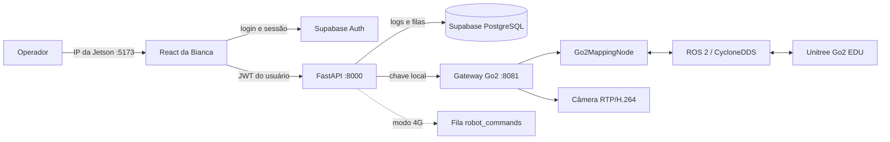

<p align="center">
  
</p>

<h1 align="center">GO2 SLAM · Operação Web Integrada</h1>

<p align="center">
  Login e auditoria com Supabase, painel React, FastAPI, câmera frontal, localização, mapa 3D e teleoperação segura do Unitree Go2 EDU.
</p>

<p align="center">
  
  
  
  
  
</p>

## Visão geral

Este repositório unifica dois projetos:

- a integração ROS/SLAM, câmera e controle do Go2;
- o frontend, backend e banco do `ProjetoOracleFrontBanco`, de Bianca Cancian.

O frontend antigo em HTML estático foi substituído pelo aplicativo React. O navegador não conversa diretamente com ROS nem recebe segredos do banco: toda ação operacional autenticada passa pelo FastAPI, que encaminha os dados para um gateway local executado na Jetson.

### O que está disponível

| Recurso | Estado | Implementação |
| --- | :---: | --- |
| Login e sessão | ✅ | Supabase Auth; sem cadastro público |
| Perfis e criação de usuários | ✅ | Administrador cria operadores ou administradores |
| Histórico de login | ✅ | FastAPI + `login_logs` com RLS |
| Painel protegido | ✅ | React Router + sessão Supabase |
| Câmera frontal | ✅ | RTP/H.264 → gateway → FastAPI → quadro protegido |
| Mapa 3D em tempo real | ✅ | LiDAR/LIO/IMU → nuvem deduplicada → Canvas React |
| Localização atual | ✅ | `X`, `Y`, `Z` e `yaw` relativos à origem |
| Salvar e reiniciar mapa | ✅ | PCD binário + JSON de metadados |
| Teleoperação `WASD` | ✅ | Avançar, recuar e girar no próprio eixo |
| Levantar e deitar | ✅ | API Sport do Go2 |
| Controle de velocidade | ✅ | Faixa completa de 5% a 100%, passos de 5% |
| Anticolisão nativo | ✅ | Serviço `obstacles_avoid` do próprio Go2 |
| Parada de emergência | ✅ | Stop + desarme do controle |
| Fila para operação 4G | ✅ | Supabase `robot_commands` |
| Solicitação Oracle | 🟡 | Fila criada; processamento externo ainda será conectado |
| Navegação autônoma | 🟡 | Próxima etapa: planner, costmap e missões |

## Arquitetura



Há duas formas de transportar comandos:

1. `ROBOT_GATEWAY_URL` configurada: o FastAPI executa imediatamente na Jetson;
2. URL vazia: o FastAPI registra o comando no Supabase para um consumidor remoto/4G.

O frontend usa o mesmo endpoint nos dois casos. Assim, a futura troca de transporte não exige reescrever os botões.

## Estrutura do repositório

```text
.
├── frontend/                 React/Vite, login e painel operacional
│   └── src/
│       ├── components/       câmera, mapa, cabeçalho e componentes comuns
│       ├── context/          sessão Supabase
│       ├── pages/            login e dashboard
│       └── services/         cliente autenticado do FastAPI
├── backend/                  API FastAPI e testes
│   └── app/
│       ├── routers/          auth, robô, Oracle e integrações
│       └── robot_gateway.py  cliente do gateway local
├── robot_gateway/            ROS 2, câmera, mapa e comandos do Go2
├── go2_native_ws/            nó LIO/SLAM e SDK Unitree
├── supabase/
│   ├── migrations/           tabelas, triggers, RLS e comandos do Go2
│   └── admin_queries.sql     consultas administrativas somente leitura
├── diagnostics/              diagnósticos de rede e sensores
├── scripts/check_supabase.sh pré-teste obrigatório do banco remoto
└── run_web.sh                inicialização completa pelo IP da Jetson
```

## Início rápido

### 1. Preparar o Supabase

No SQL Editor do projeto Supabase, aplique em ordem:

1. `supabase/migrations/202607150001_initial_schema.sql`;
2. `supabase/migrations/202607150002_sync_auth_profiles.sql`;
3. `supabase/migrations/202607160003_go2_control_commands.sql`.

Em **Authentication → Users**, crie manualmente a primeira conta e marque o e-mail como confirmado. Depois, no SQL Editor, torne-a administradora:

```sql
update public.profiles
set role = 'admin'
where email = 'email@empresa.com';
```

Por fim, desative o cadastro público nas configurações de Authentication. As demais contas serão criadas pelo administrador dentro do painel e já ficarão confirmadas para entrada imediata.

### 2. Configurar as credenciais locais

```bash
cp frontend/.env.example frontend/.env.local
cp backend/.env.example backend/.env
```

No `frontend/.env.local`, preencha apenas informações públicas:

```dotenv
VITE_SUPABASE_URL=https://SEU-PROJETO.supabase.co
VITE_SUPABASE_PUBLISHABLE_KEY=sb_publishable_...
VITE_API_URL=http://localhost:8000
```

No `backend/.env`, use o mesmo projeto e mantenha a chave secreta somente no backend:

```dotenv
SUPABASE_URL=https://SEU-PROJETO.supabase.co
SUPABASE_PUBLISHABLE_KEY=sb_publishable_...
SUPABASE_SERVICE_ROLE_KEY=sb_secret_...
ROBOT_GATEWAY_URL=http://127.0.0.1:8081
ROBOT_GATEWAY_API_KEY=uma-chave-local-longa
```

> Nunca coloque `SUPABASE_SERVICE_ROLE_KEY` em uma variável `VITE_*` ou em um commit.

### 3. Executar tudo com um comando

Na Jetson:

```bash
./run_web.sh
```

O script:

- confere se frontend e backend usam o mesmo projeto Supabase;
- testa o Supabase Auth e a chave pública;
- testa a chave privada e confirma a migration `robot_status`;
- constrói o React e o FastAPI em imagens ARM64;
- inicia o gateway ROS/SLAM local;
- publica o frontend em `http://IP-DA-JETSON:5173`;
- exibe a URL final no terminal e encerra tudo com `Ctrl+C`.

Se a detecção automática escolher a interface errada:

```bash
WEB_HOST_IP=192.168.123.18 ./run_web.sh
```

## Painel e controles

Depois do login, o usuário comum entra diretamente nos recursos operacionais pedidos: câmera, mapeamento/localização e teleoperação. O administrador vê também a opção **Usuários**, onde pode adicionar operadores ou outros administradores.

| Entrada | Ação |
| --- | --- |
| `W` ou `↑` | avançar |
| `S` ou `↓` | recuar |
| `A` ou `←` | girar à esquerda no próprio eixo |
| `D` ou `→` | girar à direita no próprio eixo |
| soltar a tecla | parar imediatamente |
| espaço | parada de movimento |
| Levantar / Deitar | mudar postura |
| `−` / `+` | ajustar velocidade segura |

Para mover, o operador precisa habilitar o controle, o robô precisa estar em pé e o anticolisão nativo precisa estar confirmado. Um heartbeat é enviado enquanto a tecla permanece pressionada; o watchdog do gateway para o robô em aproximadamente `0,35 s` se os comandos cessarem.

O cabeçalho apresenta as marcas XD4 Robotics e Oracle com o mesmo espaço visual. Os botões **Claro** e **Escuro** mudam o tema explicitamente e preservam a escolha no navegador.

## Proteção anticolisão

A locomoção usa diretamente o serviço nativo `obstacles_avoid` do Go2. O nó habilita o switch oficial, confirma seu estado e envia os comandos de velocidade pela mesma API nativa. Isso deixa a distância e a resposta aos sensores sob responsabilidade do controlador embarcado do robô, sem uma segunda zona local alternando os botões da interface.

Se o serviço nativo não confirmar que está habilitado, a locomoção permanece bloqueada. O SLAM e a criação da nuvem de pontos continuam independentes desse estado.

> Esta proteção reduz o risco, mas não transforma o robô em equipamento certificado para segurança de pessoas. O primeiro teste físico deve ser supervisionado, em baixa velocidade, com acesso à parada de emergência e sem usar uma pessoa como primeiro obstáculo.

## Mapeamento SLAM

O nó usa os tópicos nativos:

| Dado | Tópico |
| --- | --- |
| Nuvem corrigida | `/utlidar/cloud_deskewed` |
| Odometria | `/utlidar/robot_odom` |
| IMU | `/utlidar/imu` |

A nuvem é acumulada somente quando IMU, odometria e LiDAR estão recentes e estáveis. Keyframes evitam inserir quadros quase idênticos, e a deduplicação mantém um centróide por voxel confirmado. O mapa salvo fica em `go2_native_ws/maps/` nos formatos `.pcd` e `.json`.

Boas práticas:

- comece próximo de uma parede ou canto conhecido;
- mantenha a velocidade baixa durante o mapeamento;
- evite giros bruscos e impactos;
- percorra o ambiente com sobreposição visual suficiente antes de salvar;
- use **Novo mapa** ao mudar a origem física do robô.

## API FastAPI

Todas as rotas operacionais abaixo exigem `Authorization: Bearer <JWT Supabase>`:

| Método | Rota | Finalidade |
| --- | --- | --- |
| `GET` | `/api/auth/me` | usuário autenticado |
| `POST` | `/api/auth/users` | novo usuário; somente administrador |
| `POST` | `/api/auth/login-events` | auditoria de login |
| `GET` | `/api/robot/status` | sensores, pose, postura e velocidade |
| `GET` | `/api/robot/camera/frame` | último JPEG protegido |
| `GET` | `/api/robot/map/points` | nuvem 3D consolidada |
| `POST` | `/api/robot/commands` | todos os botões do painel |
| `POST` | `/api/oracle/analyses` | fila de análise Oracle |

Com o sistema iniciado, a documentação interativa fica em `http://IP-DA-JETSON:8000/docs`.

## Banco e segurança

O Supabase mantém:

- `profiles`: perfil e papel do usuário;
- `login_logs`: data, origem, IP e user-agent dos acessos;
- `robot_status`: último estado conhecido no modo 4G;
- `robot_commands`: fila alternativa de comandos;
- `oracle_analyses`: fila e resultado das análises.

Todas as tabelas têm Row Level Security. Usuários acessam apenas seus registros; a `service role` não é enviada ao navegador. O gateway ROS escuta somente em `127.0.0.1:8081` e também exige uma chave compartilhada com o FastAPI.

## Validação

Os testes usados antes de publicar:

```bash
# Frontend
cd frontend
npm ci
npm run lint
npm run build

# Backend
cd ../backend
python3 -m venv .venv
source .venv/bin/activate
pip install -e '.[dev]'
pytest

# Gateway e scripts
cd ..
python3 -m py_compile robot_gateway/server.py go2_native_ws/go2_slam/mapping_node.py
bash -n run_web.sh scripts/check_supabase.sh robot_gateway/run_gateway.sh
```

O modelo de workflow em `docs/ci/validation.yml` repete lint, build e testes.
Para ativá-lo, copie-o para `.github/workflows/ci.yml` usando uma credencial
GitHub com o escopo `workflow`.

## Solução de problemas

| Sintoma | Verificação |
| --- | --- |
| `Falta frontend/.env.local` | copie os dois `.env.example` e preencha as chaves reais |
| `robot_status não existe` | aplique as três migrations na ordem |
| Docker pede senha | informe a senha sudo da Jetson; o script não altera grupos do sistema |
| Login funciona, log não é salvo | confira a migration, o JWT e a URL do FastAPI no IP correto |
| Botões estão bloqueados | confirme SDK, postura em pé, LiDAR local e anticolisão nativo |
| Anticolisão indisponível | confira `/api/obstacles_avoid/response` e a conexão DDS com o Go2 |
| Câmera sem sinal | confirme `eth0`, multicast `230.1.1.1:1720` e GStreamer |
| Mapa vazio | confira os três tópicos LIO/IMU/odometria e a origem do mapeamento |
| Outro equipamento não abre a página | confirme que ele alcança o IP da Jetson e as portas `5173` e `8000` |

## Créditos

- frontend, backend e banco-base: [BiancaCancian/ProjetoOracleFrontBanco](https://github.com/BiancaCancian/ProjetoOracleFrontBanco);
- integração Go2, ROS/SLAM e unificação: este repositório.
